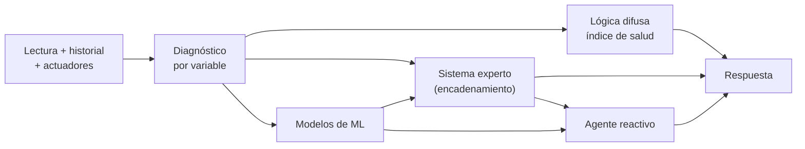

# SmartPot-AI

## Estado del Proyecto

[](https://github.com/SmartPotTech/SmartPot-AI/actions/workflows/ci.yml)
[](https://github.com/SmartPotTech/SmartPot-AI/actions/workflows/codeql.yml)
[](https://github.com/SmartPotTech/SmartPot-AI/actions/workflows/packaging.yml)

## Descripción

SmartPot-AI es el **asistente inteligente** de SmartPot. Recibe la última lectura de una maceta, su historial reciente y los actuadores disponibles, y devuelve un diagnóstico completo que combina cuatro técnicas de inteligencia artificial:

| Técnica | Qué resuelve | Dónde vive |
| --- | --- | --- |
| **Sistema experto** | Diagnóstico por variable y conclusiones encadenadas (estrés térmico, riesgo de hongos, bloqueo de nutrientes, falla de sensor…) con su explicación | `app/engine/diagnosis.py`, `expert_system.py`, `rules.py` |
| **Lógica difusa** | Índice de salud de 0 a 100 que tolera la incertidumbre de los sensores | `app/engine/fuzzy.py` |
| **Aprendizaje automático** | Regresión logística (ventilación), red neuronal MLP (corrección de pH) e Isolation Forest (lecturas atípicas) | `app/engine/models.py` |
| **Agente reactivo** | Convierte el diagnóstico en acciones sobre los actuadores que la maceta sí tiene | `app/engine/agent.py` |

Es un servicio **interno**: solo [SmartPot-API](https://github.com/SmartPotTech/SmartPot-API) lo consulta, con un token compartido, y nunca se publica en Internet.



## Base de Conocimiento

`app/knowledge/profiles.py` guarda los rangos ideales de seis especies en la escala de los sensores de la maceta: temperatura (°C), humedad del aire (%), luz (lux relativos, 0 a 2000), pH, nutrientes (ppm, EC × 700) y humedad del sustrato (%).

| Especie | Temperatura | Humedad | pH | TDS (ppm) | Sustrato |
| --- | --- | --- | --- | --- | --- |
| Lechuga (`LETTUCE`) | 15–22 | 50–70 | 5.5–6.5 | 560–840 | 60–80 |
| Tomate (`TOMATO`) | 20–28 | 60–80 | 5.5–6.5 | 1400–2800 | 55–75 |
| Fresa (`STRAWBERRY`) | 18–26 | 60–75 | 5.5–6.2 | 700–980 | 60–80 |
| Albahaca (`BASIL`) | 20–30 | 40–60 | 5.5–6.5 | 700–1120 | 50–70 |
| Espinaca (`SPINACH`) | 15–24 | 50–70 | 6.0–7.0 | 1260–1610 | 60–80 |
| Pimentón (`PEPPER`) | 21–29 | 50–70 | 5.8–6.5 | 1400–2100 | 55–75 |

Una variable fuera de rango se mide en **tolerancias** (5 °C, 15 %, 300 lux, 0.8 de pH, 400 ppm, 15 %). Desde una tolerancia completa el hallazgo es **crítico**.

## Cómo razona

1. **Diagnóstico:** cada variable queda `LOW`, `OPTIMAL` o `HIGH`, con severidad `WARNING` o `CRITICAL` y una recomendación en español. Entre las 22:00 y las 6:00 (hora local enviada en `localHour`) la luz baja queda como `REST`: es el periodo de oscuridad de la planta y no resta salud.
2. **Modelos:** las variables se normalizan respecto al perfil (0 = mínimo ideal, 1 = máximo ideal), así un mismo modelo sirve para todas las especies. Se entrenan al arrancar con 4000 muestras sintéticas y semilla fija, por lo que los resultados son reproducibles. `GET /v1/models` informa su exactitud.
3. **Sistema experto:** un motor de encadenamiento hacia adelante dispara reglas por prioridad (cada regla una sola vez). Las conclusiones de primer nivel —por ejemplo `heat_stress` o `nutrient_lockout`— alimentan reglas de segundo nivel como `compound_stress` o `critical_state`. Si el Isolation Forest y el historial indican una lectura imposible, `sensor_fault` bloquea las acciones.
4. **Lógica difusa:** cada desviación pertenece en distinto grado a los conjuntos «ideal», «aceptable», «desviada» y «crítica». La inferencia Sugeno de orden cero da la salud de cada variable, el índice global las pondera (el pH y la temperatura pesan más) y una regla de peor caso limita la salud cuando algo es crítico.
5. **Agente:** propone acciones solo para los actuadores del cultivo: riego si el sustrato está seco, luz si falta de día (y apagarla de noche), ventilación si hay calor, humedad alta o el modelo lo predice, humidificador, dosificador de pH y de nutrientes. La API aplica el enfriamiento y solo ejecuta con el modo automático activo.

## Contrato

Todas las rutas `/v1` exigen `Authorization: Bearer <SMARTPOT_AI_TOKEN>`.

| Método | Ruta | Descripción |
| --- | --- | --- |
| GET | `/health` | Público. `{"status":"UP","models":"READY"}` |
| POST | `/v1/insights` | Evalúa una lectura |
| GET | `/v1/crop-profiles` | Base de conocimiento por especie |
| GET | `/v1/models` | Exactitud de los modelos |

```json
{
  "cropType": "TOMATO",
  "measures": {"temperature": 31, "humidity": 55, "ph": 6.1, "tds": 1600, "soilMoisture": 45, "brightness": 700},
  "history": [],
  "actuators": ["WATER_PUMP", "FAN", "UV_LIGHT"],
  "localHour": 14
}
```

La respuesta trae `health` (`index`, `level`, `label`), `diagnosis`, `conclusions` (con su certeza), `predictions`, `actions` (`actuator`, `action`, `durationSeconds`, `reason`) y un `summary` como: *«Tu tomate está en estado "Saludable" (79/100). Revisa la humedad del sustrato y la temperatura. El asistente propone 2 acciones.»*

## Guía de Instalación

### Requisitos Previos

- [uv](https://docs.astral.sh/uv/) (instala Python 3.13 si hace falta)

### Ejecución local

```bash
git clone https://github.com/SmartPotTech/SmartPot-AI.git
cd SmartPot-AI
cp .env.example .env    # define SMARTPOT_AI_TOKEN (mínimo 24 caracteres)
uv sync
uv run uvicorn app.main:app --reload --port 8000
```

Con `DOCS_ENABLED=true` la documentación interactiva queda en `http://localhost:8000/docs`.

### Pruebas

```bash
uv run ruff check .
uv run pytest
```

Cubren la base de conocimiento, el encadenamiento de reglas, la monotonía del índice difuso, la exactitud mínima de los modelos, las decisiones del agente y el contrato HTTP.

### Imagen Docker

```bash
docker build -t smartpot-ai .
docker pull ghcr.io/smartpottech/smartpot-ai:latest
```

La imagen instala las dependencias con uv en una etapa aparte, corre como el usuario `1000` y admite sistema de archivos de solo lectura.

## Licencia

Este proyecto está bajo la licencia MIT. Consulta el archivo [LICENSE](LICENSE) para más detalles.
