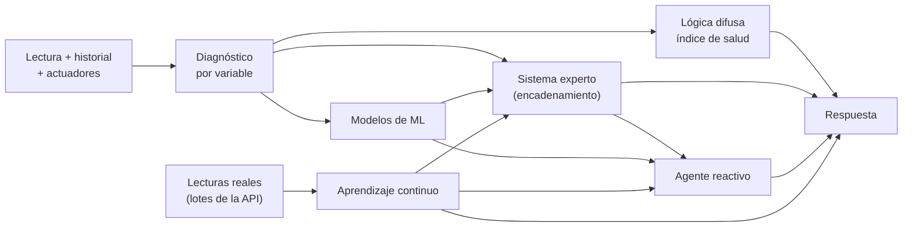

# SmartPot-AI

## Estado del Proyecto

[](https://github.com/SmartPotTech/SmartPot-AI/actions/workflows/ci.yml)
[](https://github.com/SmartPotTech/SmartPot-AI/actions/workflows/codeql.yml)
[](https://github.com/SmartPotTech/SmartPot-AI/actions/workflows/packaging.yml)

## Descripción

SmartPot-AI es el **asistente inteligente** de SmartPot. Recibe la última lectura de un cultivo, su historial reciente,
los actuadores disponibles, dónde está y el clima de afuera, y devuelve un diagnóstico completo que combina estas técnicas de inteligencia artificial:

| Técnica                    | Qué resuelve                                                                                                                                                                                         | Dónde vive                                                |
|----------------------------|------------------------------------------------------------------------------------------------------------------------------------------------------------------------------------------------------|-----------------------------------------------------------|
| **Sistema experto**        | Diagnóstico por variable y conclusiones encadenadas (estrés térmico, riesgo de hongos, bloqueo de nutrientes, falla de sensor…) con su explicación                                                   | `app/engine/diagnosis.py`, `expert_system.py`, `rules.py` |
| **Lógica difusa**          | Índice de salud de 0 a 100 que tolera la incertidumbre de los sensores                                                                                                                               | `app/engine/fuzzy.py`                                     |
| **Aprendizaje automático** | Regresión logística (ventilación), red neuronal MLP (corrección de pH) e Isolation Forest (lecturas atípicas)                                                                                        | `app/engine/models.py`                                    |
| **Agente reactivo**        | Convierte el diagnóstico en acciones sobre los actuadores que el cultivo sí tiene                                                                                                                    | `app/engine/agent.py`                                     |
| **Pronóstico**             | Tendencia de cada variable (Theil-Sen) y horas hasta salir del rango ideal                                                                                                                           | `app/engine/forecast.py`                                  |
| **Análisis de flota**      | Ranking, problemas compartidos del entorno, grupos K-Means y acciones en bloque                                                                                                                      | `app/engine/fleet.py`                                     |
| **Consejo de lugar**       | Compara la luz que pide la especie con la que recibe el cultivo y sube el tono solo cuando el lugar ya afecta la salud                                                                               |                                                           |
| **Aprendizaje continuo**   | Aprende de las lecturas reales: supervisado (¿se secará?, ¿habrá calor?, humedad en 1 h) y no supervisado (estados de operación y lecturas atípicas), con reentrenamiento cuando llegan datos nuevos | `app/learning/`                                           |

Es un servicio **interno**: solo [SmartPot-API](https://github.com/SmartPotTech/SmartPot-API) lo consulta, con un token
compartido, y nunca se publica en Internet.



## Base de Conocimiento

`app/knowledge/profiles.py` guarda los rangos ideales de seis especies en la escala de los sensores del dispositivo:
temperatura (°C), humedad del aire (%), luz (lux relativos, 0 a 2000), pH, nutrientes (ppm, EC × 700) y humedad del
sustrato (%).

| Especie              | Temperatura | Humedad | pH      | TDS (ppm) | Sustrato |
|----------------------|-------------|---------|---------|-----------|----------|
| Lechuga (`LETTUCE`)  | 15–22       | 50–70   | 5.5–6.5 | 560–840   | 60–80    |
| Tomate (`TOMATO`)    | 20–28       | 60–80   | 5.5–6.5 | 1400–2800 | 55–75    |
| Fresa (`STRAWBERRY`) | 18–26       | 60–75   | 5.5–6.2 | 700–980   | 60–80    |
| Albahaca (`BASIL`)   | 20–30       | 40–60   | 5.5–6.5 | 700–1120  | 50–70    |
| Espinaca (`SPINACH`) | 15–24       | 50–70   | 6.0–7.0 | 1260–1610 | 60–80    |
| Pimentón (`PEPPER`)  | 21–29       | 50–70   | 5.8–6.5 | 1400–2100 | 55–75    |

Una variable fuera de rango se mide en **tolerancias** (5 °C, 15 %, 300 lux, 0.8 de pH, 400 ppm, 15 %). Desde una
tolerancia completa el hallazgo es **crítico**.

## Cómo razona

1. **Diagnóstico:** cada variable queda `LOW`, `OPTIMAL` o `HIGH`, con severidad `WARNING` o `CRITICAL` y una
   recomendación en español. Entre las 22:00 y las 6:00 (hora local enviada en `localHour`) la luz baja queda como
   `REST`: es el periodo de oscuridad de la planta y no resta salud.
2. **Modelos:** las variables se normalizan respecto al perfil (0 = mínimo ideal, 1 = máximo ideal), así un mismo modelo
   sirve para todas las especies. Se entrenan al arrancar con 4000 muestras sintéticas y semilla fija, por lo que los
   resultados son reproducibles. `GET /v1/models` informa su exactitud.
3. **Sistema experto:** un motor de encadenamiento hacia adelante dispara reglas por prioridad (cada regla una sola
   vez). Las conclusiones de primer nivel —por ejemplo `heat_stress` o `nutrient_lockout`— alimentan reglas de segundo
   nivel como `compound_stress` o `critical_state`. Si el Isolation Forest y el historial indican una lectura imposible,
   `sensor_fault` bloquea las acciones.
4. **Lógica difusa:** cada desviación pertenece en distinto grado a los conjuntos «ideal», «aceptable», «desviada» y
   «crítica». La inferencia Sugeno de orden cero da la salud de cada variable, el índice global las pondera (el pH y la
   temperatura pesan más) y una regla de peor caso limita la salud cuando algo es crítico.
5. **Pronóstico:** con el historial y la hora de cada lectura, el estimador de Theil-Sen (mediana de las pendientes
   entre pares, resistente a lecturas atípicas) calcula la pendiente por hora, el valor esperado en 3 h y en cuántas
   horas la variable saldría de su rango. Alimenta las reglas `drying_trend` y `heat_building`.
6. **Agente:** propone acciones solo para los actuadores del cultivo: riego si el sustrato está seco (salvo que llueva
   sobre un cultivo al aire libre), luz ultravioleta si falta de día (y apagarla de noche), ventilación si hay calor, humedad alta o el modelo lo predice, humidificador, dosificador
   de pH y de nutrientes. Si el pronóstico indica que el sustrato llegará al mínimo o la temperatura al máximo en menos
   de 1 h, actúa antes (riego o ventilación preventivos). La API aplica el enfriamiento y solo ejecuta con el modo
   automático activo.
7. **Aprendizaje:** lo aprendido de las lecturas reales de la especie (ver abajo) entra al sistema experto (
   `learned_drying`, `learned_heat`, `unusual_pattern`) y, con probabilidad de 85 % o más, al agente como riego o
   ventilación preventivos.
8. **Lugar y clima:** con `placement` (bajo techo o al aire libre y cuánto sol recibe) y `weather` (el clima de afuera
   que la API pide al simulador), la evaluación devuelve `placement`: `OK` si el lugar le sirve a la especie, `UNKNOWN`
   si no se sabe dónde está, `TIP` si no es el ideal pero la planta está bien y `MOVE` si el lugar ya se nota en las
   lecturas. Al aire libre suma dos reglas: `rain_outside` (con 0,5 mm o más de lluvia no hace falta regar) y
   `sensor_vs_outside` (el sensor se aleja 8 °C o más del clima de afuera).
9. **Flota:** `POST /v1/fleet` recibe todos los cultivos de una cuenta y devuelve el ranking por salud, los problemas
   que se repiten en la mitad o más de los cultivos (señal de que el problema es el entorno), grupos por condiciones
   similares con K-Means (la cantidad de grupos se elige por silueta) y las acciones del agente reunidas por actuador
   para aplicarlas en bloque.

## Aprendizaje Continuo

Los modelos base se entrenan con datos sintéticos; el aprendizaje continuo los complementa con lo que de verdad pasa en
los cultivos reales. La API envía por lotes cada lectura de un cultivo real que llega por MQTT (las de los cultivos
virtuales son sintéticas y no se envían) (`POST /v1/learning/readings`) y el servicio las guarda en SQLite dentro del
volumen `/data`, con el id del cultivo **seudonimizado** (SHA-256): aprende de la serie de cada cultivo sin saber a
quién pertenece.

| Paso                          | Qué hace                                                                                                                                                                                                  | Dónde         |
|-------------------------------|-----------------------------------------------------------------------------------------------------------------------------------------------------------------------------------------------------------|---------------|
| 1. Calidad de datos           | Completitud, validez física y atípicos por rango intercuartílico (k = 3), que se excluyen; da un puntaje DQS                                                                                              | `quality.py`  |
| 2. Variables                  | Posición de cada variable en su rango ideal, hora del día circular (seno y coseno) y tendencia de la última media hora                                                                                    | `features.py` |
| 3. Etiquetas autosupervisadas | Lo que pasó en la hora siguiente: ¿el sustrato bajó del mínimo?, ¿la temperatura pasó del máximo?, ¿cuánto cambió la humedad?                                                                             | `features.py` |
| 4. Comparación de modelos     | Línea base, regresión logística, K vecinos, árbol de decisión, bosque aleatorio, gradient boosting y red neuronal, con validación cruzada temporal (`TimeSeriesSplit`, 4 cortes) y F1 macro o error medio | `trainer.py`  |
| 5. Ajuste                     | `GridSearchCV` sobre el mejor candidato                                                                                                                                                                   | `trainer.py`  |
| 6. Campeón y retador          | Se evalúa en el 20 % de lecturas más recientes; el modelo nuevo reemplaza al vigente solo si lo mejora y si supera a la línea base                                                                        | `trainer.py`  |
| 7. No supervisado             | Estados de operación con K-Means (k de 2 a 6 por silueta, con nombre legible) e Isolation Forest entrenado con lecturas reales                                                                            | `trainer.py`  |

Cada especie se entrena por separado desde 200 lecturas etiquetadas y se reentrena cada 300 lecturas nuevas, en un
proceso aparte para no frenar las evaluaciones. Los modelos se guardan con joblib en `/data/models` y se cargan al
arrancar. Una tarea queda pendiente, con su razón, mientras falten datos o casos (por ejemplo, si ningún cultivo de la
especie ha tenido calor no se puede aprender a anticiparlo).

`POST /v1/insights` responde además `learning`: el estado de operación actual, si la lectura es atípica para la especie,
la probabilidad de necesitar riego o ventilación en la próxima hora y la humedad esperada del sustrato en 1 h, cada una
con el modelo y su puntaje.

## Contrato

Todas las rutas `/v1` exigen `Authorization: Bearer <SMARTPOT_AI_TOKEN>`.

| Método | Ruta                          | Descripción                                                                           |
|--------|-------------------------------|---------------------------------------------------------------------------------------|
| GET    | `/health`                     | Público. `{"status":"UP","models":"READY","learning":"PERSISTENT"}`                   |
| POST   | `/v1/insights`                | Evalúa una lectura                                                                    |
| POST   | `/v1/fleet`                   | Analiza todos los cultivos de una cuenta                                              |
| GET    | `/v1/crop-profiles`           | Base de conocimiento por especie                                                      |
| GET    | `/v1/models`                  | Exactitud de los modelos base                                                         |
| POST   | `/v1/learning/readings`       | Recibe hasta 2000 lecturas reales por lote                                            |
| GET    | `/v1/learning/status`         | Lecturas, calidad, comparación de modelos, estados y detector de atípicos por especie |
| POST   | `/v1/learning/train`          | Entrena ya una especie (`{"cropType":"LETTUCE"}`) o las que tienen datos nuevos       |
| DELETE | `/v1/learning/crops/{cropId}` | Olvida las lecturas de un cultivo eliminado                                           |

```json
{
  "cropType": "TOMATO",
  "measures": {"temperature": 31, "humidity": 55, "ph": 6.1, "tds": 1600, "soilMoisture": 45, "brightness": 700},
  "history": [],
  "actuators": ["WATER_PUMP", "FAN", "UV_LIGHT"],
  "localHour": 14,
  "placement": {"setting": "OUTDOOR", "exposure": "FULL_SUN"},
  "weather": {"temperature": 24.4, "humidity": 63, "radiation": 520, "precipitation": 0, "isDay": true}
}
```

Cada elemento de `history` puede traer `measuredAt` (ISO 8601); con al menos 6 lecturas que abarquen 20 minutos se
calculan los pronósticos.

```json
{"forecasts": [{"parameter": "soilMoisture", "trend": "FALLING", "slopePerHour": -6.0, "hoursToLimit": 0.7, "limit": "MIN",
  "message": "La humedad del sustrato baja 6 % por hora: llegará al mínimo (60 %) en unos 40 minutos."}]}
```

La respuesta trae `health` (`index`, `level`, `label` y `byParameter`, la salud de cada variable que explica el índice),
`forecasts`, `diagnosis`, `conclusions` (con su certeza), `predictions`, `placement` (el consejo de lugar), `actions` (`actuator`, `action`,
`durationSeconds`, `reason`) y un `summary` como: *«Tu tomate está en estado "Saludable" (79/100). Revisa la humedad del
sustrato y la temperatura. El asistente propone 2 acciones.»*

## Guía de Instalación

### Requisitos Previos

- [uv](https://docs.astral.sh/uv/) (instala Python 3.13 si hace falta)

### Ejecución local

```bash
git clone https://github.com/SmartPotTech/SmartPot-AI.git
cd SmartPot-AI
cp .env.example .env    # define SMARTPOT_AI_TOKEN (mínimo 24 caracteres)
uv sync
uv run uvicorn app.main:app --reload --port 8000
```

Con `DOCS_ENABLED=true` la documentación interactiva queda en `http://localhost:8000/docs`.

### Pruebas

```bash
uv run ruff check .
uv run pytest
```

Cubren la base de conocimiento, el encadenamiento de reglas, la monotonía del índice difuso, la exactitud mínima de los
modelos, las decisiones del agente, la lluvia y el sensor frente al clima, el consejo de lugar, el contrato HTTP y el
aprendizaje continuo: seudonimización, poda, calidad de datos,
etiquetas, modelos que superan a la línea base, campeón y retador, persistencia y la respuesta `learning`.

### Imagen Docker

```bash
docker build -t smartpot-ai .
docker pull ghcr.io/smartpottech/smartpot-ai:latest
```

La imagen instala las dependencias con uv en una etapa aparte, corre como el usuario `1000` y admite sistema de archivos
de solo lectura. Monta un volumen en `/data` para conservar lo aprendido; sin él, el aprendizaje funciona en memoria y
se pierde al reiniciar.

Cada cambio en `main` pasa por el CI, publica la imagen en GHCR (y en Docker Hub como réplica cuando el repositorio
tiene credenciales) y pide el despliegue al workflow central
de [SmartPotTech/.github](https://github.com/SmartPotTech/.github), que actualiza producción de a uno y verifica
`/health`.

## Documentación

El asistente es un servicio interno: la API le pregunta y aplica sus respuestas. Su documentación propia está en [
`docs/`](docs/SmartPot_AI_Documentation.md) (también en [DOCX](docs/SmartPot_AI_Documentation.docx)
y [PDF](docs/SmartPot_AI_Documentation.pdf)), con sus diagramas en [`docs/diagrams`](docs/diagrams): el general del
componente y los de la evaluación, el aprendizaje continuo y el análisis de flota.
La [documentación técnica](https://github.com/SmartPotTech/.github/blob/main/docs/SmartPot_Technical_Documentation.md)
explica la base de conocimiento, las 21 reglas, el consejo de lugar, el índice difuso, el pronóstico, el análisis de flota y el aprendizaje
continuo. Los diagramas generales muestran la plataforma completa en una sola imagen ampliable:

- [Decisión de la IA](https://github.com/SmartPotTech/.github/blob/main/docs/diagrams/SmartPot_Global_08_AI_Decision.svg):
  de la lectura a la orden: diagnóstico, pronóstico, modelos, reglas, índice difuso y agente
- [Linaje de los datos](https://github.com/SmartPotTech/.github/blob/main/docs/diagrams/SmartPot_Global_04_Data_Lineage.svg):
  cómo llegan las lecturas de los cultivos reales al aprendizaje y qué se guarda
- [Máquinas de estado](https://github.com/SmartPotTech/.github/blob/main/docs/diagrams/SmartPot_Global_05_State_Machines.svg):
  los estados del aprendizaje de cada especie

## Licencia

Este proyecto está bajo la licencia MIT. Consulta el archivo [LICENSE](LICENSE) para más detalles.
