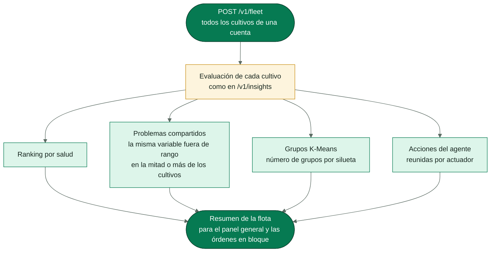

<!-- portada
eyebrow: Documentación del componente
titulo: SmartPot-AI
acento: AI
subtitulo: El asistente inteligente de SmartPot
bajada: Sistema experto, lógica difusa, modelos de aprendizaje automático, agente reactivo, pronóstico, análisis de flota y aprendizaje continuo con las lecturas de los cultivos reales.
documento: SmartPot-AI
version: 1.0 · septiembre 2026
equipo: SmartPotTech
proyecto: smartpot.app
-->

# SmartPot-AI

## Ficha del documento

| Campo | Valor |
| --- | --- |
| Proyecto | SmartPot · [smartpot.app](https://smartpot.app) |
| Componente | [SmartPot-AI](https://github.com/SmartPotTech/SmartPot-AI) |
| Versión | 1.0 · septiembre 2026 |
| Alcance | Cómo razona el asistente, aprendizaje continuo, análisis de flota, contrato, configuración, pruebas y operación |
| Documentación de la plataforma | [Documentación técnica](https://github.com/SmartPotTech/.github/blob/main/docs/SmartPot_Technical_Documentation.md), [recorrido del proyecto](https://github.com/SmartPotTech/.github/blob/main/docs/SmartPot_Project_Journey.md), [ciclo de vida](https://github.com/SmartPotTech/.github/blob/main/docs/SmartPot_Software_Lifecycle.md) y [diagramas generales](https://github.com/SmartPotTech/.github/blob/main/docs/README.md#diagramas-generales) |
| Mantenimiento | Se genera desde `docs/` de este repositorio con las herramientas de `.github/docs/tools`; se actualiza con cada cambio del componente |

<!-- parte: PARTE I | El componente -->

## 1. Propósito

### En palabras simples

SmartPot-AI es el agrónomo de la plataforma. La API le manda la última lectura de un cultivo, su historial y sus actuadores; el asistente responde cómo está (un índice de salud de 0 a 100), por qué, qué va a pasar en las próximas horas y qué conviene hacer. Además aprende sin parar de las lecturas de los cultivos reales de cada especie, sin saber de qué cuenta viene cada una. Es un servicio interno: solo la API lo consulta, con un token.

| Técnica | Qué resuelve |
| --- | --- |
| Sistema experto | Diagnóstico por variable y conclusiones encadenadas con su explicación |
| Lógica difusa | Índice de salud que tolera la incertidumbre de los sensores |
| Aprendizaje automático | Ventilación, corrección de pH y lecturas atípicas |
| Pronóstico | Tendencia de cada variable y horas hasta salir del rango |
| Agente reactivo | Acciones sobre los actuadores que el cultivo sí tiene |
| Análisis de flota | Ranking, problemas del entorno, grupos y acciones en bloque |
| Aprendizaje continuo | Modelos que mejoran con las lecturas reales y solo reemplazan al vigente si lo superan |

## 2. Arquitectura del componente

```mermaid
%%{init: {"theme": "base", "fontFamily": "Segoe UI, Arial, sans-serif", "themeVariables": {"fontFamily": "Segoe UI, Arial, sans-serif", "fontSize": "15px", "primaryColor": "#DDF5EA", "primaryTextColor": "#17261F", "primaryBorderColor": "#067A52", "secondaryColor": "#E3F2FB", "secondaryTextColor": "#17261F", "secondaryBorderColor": "#1F6FA0", "tertiaryColor": "#F2F7F4", "tertiaryTextColor": "#17261F", "tertiaryBorderColor": "#D5E3DC", "lineColor": "#5B6B63", "textColor": "#17261F", "mainBkg": "#DDF5EA", "nodeBorder": "#067A52", "clusterBkg": "#F7FAF8", "clusterBorder": "#D5E3DC", "edgeLabelBackground": "#FFFFFF", "actorBkg": "#067A52", "actorBorder": "#0B3D2B", "actorTextColor": "#FFFFFF", "actorLineColor": "#5B6B63", "signalColor": "#17261F", "signalTextColor": "#17261F", "labelBoxBkgColor": "#0B3D2B", "labelBoxBorderColor": "#0B3D2B", "labelTextColor": "#FFFFFF", "loopTextColor": "#0B3D2B", "noteBkgColor": "#FDF4DD", "noteBorderColor": "#C98D12", "noteTextColor": "#17261F", "activationBkgColor": "#DDF5EA", "activationBorderColor": "#067A52", "attributeBackgroundColorOdd": "#FFFFFF", "attributeBackgroundColorEven": "#F2F7F4"}, "layout": "elk", "elk": {"nodePlacementStrategy": "BRANDES_KOEPF", "mergeEdges": false, "cycleBreakingStrategy": "GREEDY"}}}%%
flowchart LR
  api["SmartPot-API<br/>token de servicio"]
  subgraph svc["SmartPot-AI · FastAPI · Python 3.13"]
    direction TB
    core["core<br/>token en tiempo constante · configuración"]
    subgraph routers["routers"]
      direction TB
      health["health<br/>GET /health"]
      insights["insights<br/>POST /v1/insights · POST /v1/fleet<br/>GET /v1/crop-profiles · GET /v1/models"]
      learnr["learning<br/>POST readings · GET status<br/>POST train · DELETE crops/{id}"]
    end
    knowledge["knowledge/profiles<br/>seis especies · tolerancias"]
    subgraph engine["engine"]
      direction TB
      diag["diagnosis"]
      fc["forecast · Theil-Sen"]
      models["models · base sintética"]
      expert["expert_system · rules"]
      fuzzy["fuzzy · Sugeno"]
      agent["agent"]
      fleet["fleet · K-Means"]
    end
    subgraph learning["learning"]
      direction TB
      store["store · SQLite"]
      quality["quality · IQR"]
      features["features · etiquetas"]
      trainer["trainer · proceso aparte"]
      lservice["service · predicciones"]
    end
  end
  data[("Volumen /data<br/>learning.db · models/*.joblib")]
  api --> core --> routers
  insights --> diag --> fc --> models --> expert --> fuzzy --> agent
  insights --> fleet
  knowledge --> diag & fuzzy & agent
  learnr --> store --> quality --> features --> trainer --> lservice
  lservice --> expert & agent
  store & trainer --> data
  classDef leaf fill:#DDF5EA,stroke:#067A52,color:#17261F
  classDef water fill:#E3F2FB,stroke:#1F6FA0,color:#17261F
  classDef sun fill:#FDF4DD,stroke:#C98D12,color:#17261F
  classDef clay fill:#FBE9E1,stroke:#B85A38,color:#17261F
  classDef core fill:#067A52,stroke:#0B3D2B,color:#FFFFFF
  classDef deep fill:#0B3D2B,stroke:#06281C,color:#FFFFFF
  classDef muted fill:#F2F7F4,stroke:#5B6B63,color:#17261F
  class api water
  class core,health,insights,learnr sun
  class knowledge muted
  class diag,fc,models,expert,fuzzy,agent,fleet leaf
  class store,quality,features,trainer,lservice core
  class data muted
```

<!-- diagrama: SmartPot_AI_Global_Component | titulo=SmartPot-AI por dentro | lamina=H -->

<!-- parte: PARTE II | Razonamiento -->

## 3. Cómo razona una evaluación

```mermaid
%%{init: {"theme": "base", "fontFamily": "Segoe UI, Arial, sans-serif", "themeVariables": {"fontFamily": "Segoe UI, Arial, sans-serif", "fontSize": "15px", "primaryColor": "#DDF5EA", "primaryTextColor": "#17261F", "primaryBorderColor": "#067A52", "secondaryColor": "#E3F2FB", "secondaryTextColor": "#17261F", "secondaryBorderColor": "#1F6FA0", "tertiaryColor": "#F2F7F4", "tertiaryTextColor": "#17261F", "tertiaryBorderColor": "#D5E3DC", "lineColor": "#5B6B63", "textColor": "#17261F", "mainBkg": "#DDF5EA", "nodeBorder": "#067A52", "clusterBkg": "#F7FAF8", "clusterBorder": "#D5E3DC", "edgeLabelBackground": "#FFFFFF", "actorBkg": "#067A52", "actorBorder": "#0B3D2B", "actorTextColor": "#FFFFFF", "actorLineColor": "#5B6B63", "signalColor": "#17261F", "signalTextColor": "#17261F", "labelBoxBkgColor": "#0B3D2B", "labelBoxBorderColor": "#0B3D2B", "labelTextColor": "#FFFFFF", "loopTextColor": "#0B3D2B", "noteBkgColor": "#FDF4DD", "noteBorderColor": "#C98D12", "noteTextColor": "#17261F", "activationBkgColor": "#DDF5EA", "activationBorderColor": "#067A52", "attributeBackgroundColorOdd": "#FFFFFF", "attributeBackgroundColorEven": "#F2F7F4"}}}%%
flowchart TB
  req(["POST /v1/insights<br/>especie · medidas · historial · actuadores · hora local"])
  req --> diag["1 · Diagnóstico por variable<br/>LOW · OPTIMAL · HIGH · REST de noche<br/>severidad en tolerancias"]
  diag --> fc["2 · Pronóstico Theil-Sen<br/>pendiente por hora · valor en 3 h<br/>horas hasta salir del rango"]
  fc --> ml["3 · Modelos<br/>base sintéticos: logística, MLP, Isolation Forest<br/>aprendidos de cultivos reales si existen"]
  ml --> es["4 · Sistema experto<br/>encadenamiento hacia adelante<br/>primer y segundo nivel · sensor_fault bloquea"]
  es --> fz["5 · Lógica difusa<br/>salud por variable · índice ponderado<br/>peor caso si algo es crítico"]
  fz --> ag["6 · Agente reactivo<br/>solo actuadores del cultivo<br/>preventivo si el pronóstico o lo aprendido lo anticipa"]
  ag --> out(["Respuesta<br/>health · diagnosis · conclusions · predictions<br/>forecasts · learning · actions · summary"])
  classDef leaf fill:#DDF5EA,stroke:#067A52,color:#17261F
  classDef water fill:#E3F2FB,stroke:#1F6FA0,color:#17261F
  classDef sun fill:#FDF4DD,stroke:#C98D12,color:#17261F
  classDef clay fill:#FBE9E1,stroke:#B85A38,color:#17261F
  classDef core fill:#067A52,stroke:#0B3D2B,color:#FFFFFF
  classDef deep fill:#0B3D2B,stroke:#06281C,color:#FFFFFF
  classDef muted fill:#F2F7F4,stroke:#5B6B63,color:#17261F
  class req,out core
  class diag,fc,ml,es,fz,ag leaf
```

<!-- diagrama: SmartPot_AI_01_Insight_Pipeline | titulo=De la lectura a la respuesta -->

| Paso | Detalle |
| --- | --- |
| Base de conocimiento | Rangos ideales de lechuga, tomate, fresa, albahaca, espinaca y pimentón en la escala de los sensores; una variable fuera de rango se mide en tolerancias y desde una completa es crítica |
| Noche | Entre las 22:00 y las 6:00 la luz baja es descanso (`REST`) y no resta salud |
| Modelos base | Se entrenan al arrancar con 4000 muestras sintéticas y semilla fija; `GET /v1/models` informa su exactitud |
| Reglas | Encadenamiento hacia adelante con prioridades; `sensor_fault` bloquea las acciones si la lectura es imposible |
| Agente | Riego, luz de día (y apagarla de noche), ventilación, humidificador y dosificadores, solo si el cultivo tiene el actuador; la API aplica el enfriamiento y el modo automático |

## 4. Aprendizaje continuo

```mermaid
%%{init: {"theme": "base", "fontFamily": "Segoe UI, Arial, sans-serif", "themeVariables": {"fontFamily": "Segoe UI, Arial, sans-serif", "fontSize": "15px", "primaryColor": "#DDF5EA", "primaryTextColor": "#17261F", "primaryBorderColor": "#067A52", "secondaryColor": "#E3F2FB", "secondaryTextColor": "#17261F", "secondaryBorderColor": "#1F6FA0", "tertiaryColor": "#F2F7F4", "tertiaryTextColor": "#17261F", "tertiaryBorderColor": "#D5E3DC", "lineColor": "#5B6B63", "textColor": "#17261F", "mainBkg": "#DDF5EA", "nodeBorder": "#067A52", "clusterBkg": "#F7FAF8", "clusterBorder": "#D5E3DC", "edgeLabelBackground": "#FFFFFF", "actorBkg": "#067A52", "actorBorder": "#0B3D2B", "actorTextColor": "#FFFFFF", "actorLineColor": "#5B6B63", "signalColor": "#17261F", "signalTextColor": "#17261F", "labelBoxBkgColor": "#0B3D2B", "labelBoxBorderColor": "#0B3D2B", "labelTextColor": "#FFFFFF", "loopTextColor": "#0B3D2B", "noteBkgColor": "#FDF4DD", "noteBorderColor": "#C98D12", "noteTextColor": "#17261F", "activationBkgColor": "#DDF5EA", "activationBorderColor": "#067A52", "attributeBackgroundColorOdd": "#FFFFFF", "attributeBackgroundColorEven": "#F2F7F4"}}}%%
flowchart LR
  batch(["Lote de la API<br/>solo cultivos reales · hasta 2000"]) --> store["store<br/>SQLite en /data · cultivo seudonimizado SHA-256<br/>retención por días y tope de filas"]
  store --> trigger{"¿Toca entrenar?<br/>desde 200 etiquetadas<br/>cada 300 nuevas"}
  trigger -->|"No"| wait(["Espera más lecturas"])
  trigger -->|"Sí"| quality["quality<br/>completitud · validez física<br/>atípicos IQR k = 3 · DQS"]
  quality --> features["features<br/>posición en el rango · hora circular<br/>tendencia · etiquetas de la hora siguiente"]
  features --> compare["trainer<br/>línea base y seis modelos<br/>TimeSeriesSplit de 4 cortes"]
  compare --> tune["GridSearchCV<br/>sobre el mejor candidato"]
  tune --> duel{"¿Supera al campeón<br/>y a la línea base en el<br/>20 % más reciente?"}
  duel -->|"Sí"| champion["Nuevo campeón<br/>models/*.joblib"]
  duel -->|"No"| keep["Se conserva el vigente"]
  features --> unsup["No supervisado<br/>K-Means por silueta · Isolation Forest"]
  champion & keep & unsup --> use(["learning en cada evaluación<br/>reglas learned_* y agente preventivo"])
  classDef leaf fill:#DDF5EA,stroke:#067A52,color:#17261F
  classDef water fill:#E3F2FB,stroke:#1F6FA0,color:#17261F
  classDef sun fill:#FDF4DD,stroke:#C98D12,color:#17261F
  classDef clay fill:#FBE9E1,stroke:#B85A38,color:#17261F
  classDef core fill:#067A52,stroke:#0B3D2B,color:#FFFFFF
  classDef deep fill:#0B3D2B,stroke:#06281C,color:#FFFFFF
  classDef muted fill:#F2F7F4,stroke:#5B6B63,color:#17261F
  class batch,use core
  class store,quality,features,compare,tune,unsup leaf
  class trigger,duel sun
  class champion,keep,wait muted
```

<!-- diagrama: SmartPot_AI_02_Learning_Cycle | titulo=Ciclo del aprendizaje continuo | lamina=H -->

Solo aprende de cultivos **reales**: la API no envía las lecturas de los cultivos virtuales, que son sintéticas. Cada especie entrena por separado y en un proceso aparte para no frenar las evaluaciones; una tarea queda pendiente, con su razón, mientras falten datos o casos. Borrar un cultivo borra sus lecturas.

## 5. Análisis de flota

<!-- diagrama: SmartPot_AI_03_Fleet_Analysis | titulo=Análisis de todos los cultivos de una cuenta -->

<!-- parte: PARTE III | Operación -->

## 6. Contrato

Todas las rutas `/v1` exigen `Authorization: Bearer <SMARTPOT_AI_TOKEN>`; el [README](../README.md#contrato) trae ejemplos de petición y respuesta.

| Método | Ruta | Descripción |
| --- | --- | --- |
| GET | `/health` | Estado de los modelos y del almacén de aprendizaje |
| POST | `/v1/insights` | Evalúa una lectura |
| POST | `/v1/fleet` | Analiza todos los cultivos de una cuenta |
| GET | `/v1/crop-profiles`, `/v1/models` | Base de conocimiento y exactitud de los modelos base |
| POST, GET | `/v1/learning/readings`, `/v1/learning/status` | Recibe lecturas reales por lote; informa lo aprendido por especie |
| POST, DELETE | `/v1/learning/train`, `/v1/learning/crops/{cropId}` | Entrena ya; olvida un cultivo borrado |

## 7. Configuración

| Variable | Uso |
| --- | --- |
| `SMARTPOT_AI_TOKEN` | Token de servicio, al menos 24 caracteres |
| `DOCS_ENABLED`, `LOG_LEVEL` | Documentación interactiva y nivel de registro |
| `MODEL_SEED` | Semilla de los modelos base |
| `DATA_DIR` | Carpeta de SQLite y modelos (volumen `/data` en la imagen) |
| `LEARNING_MIN_SAMPLES`, `LEARNING_RETRAIN_EVERY` | Lecturas para el primer entrenamiento y cada cuántas nuevas se reentrena |
| `LEARNING_CHECK_SECONDS`, `LEARNING_RETENTION_DAYS` | Cada cuánto revisa si toca entrenar y cuántos días guarda |

## 8. Pruebas

`uv run ruff check .` y `uv run pytest`: 73 pruebas sobre la base de conocimiento, el encadenamiento de reglas, la monotonía del índice difuso, la exactitud mínima de los modelos, el pronóstico, el agente, la flota, el contrato HTTP y el aprendizaje continuo (seudonimización, poda, calidad, etiquetas, modelos que superan a la línea base, campeón y retador, persistencia).

## 9. Operación

| Tarea | Cómo |
| --- | --- |
| Imagen | `ghcr.io/smartpottech/smartpot-ai`: dependencias con uv, usuario `1000`, solo lectura; `/data` en un volumen para conservar lo aprendido |
| Red | Solo en la red interna, sin salida a internet ni puertos publicados |
| Entrenamientos | `docker logs smartpot-ai` muestra cada uno; la PWA los resume en Aprendizaje |
| Despliegue | Cada cambio en `main` pasa por el CI, publica la imagen y pide el despliegue central de `.github` |
